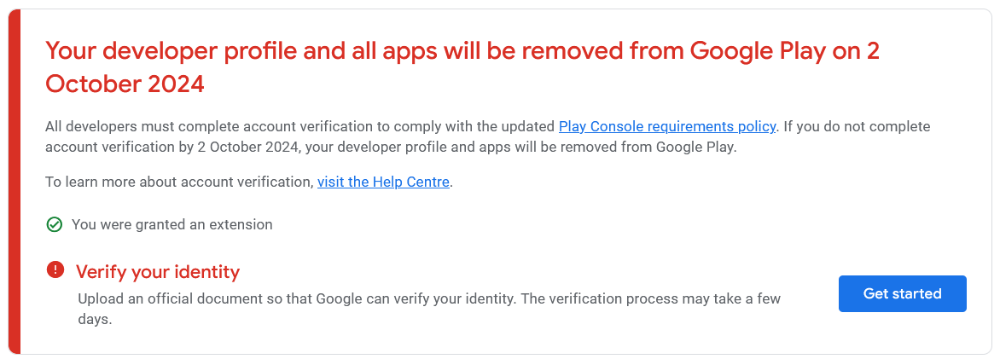
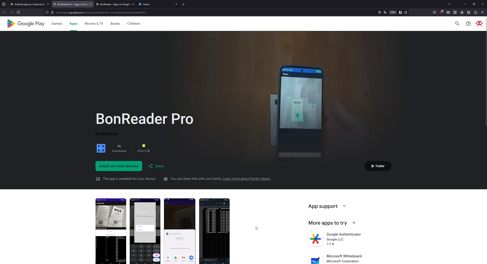
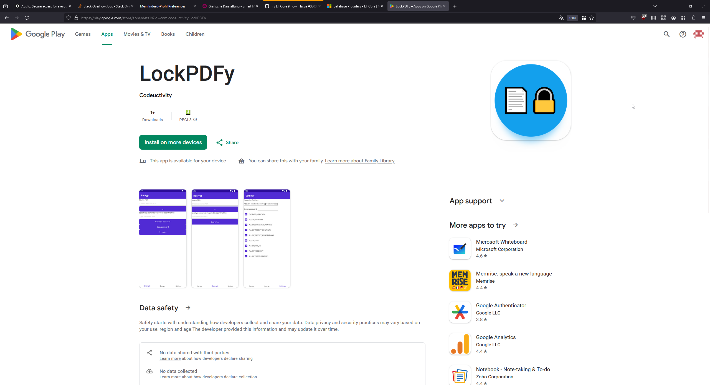

Google Play Store is a great platform to distribute Android apps. However, the recurring effort to keep the changing regulatory requirement up to date is not worth it for me. I have decided to let my dev profile fade away and focus on other things.

The apps look like this in the Google Play Store:

### BonReader Pro

https://play.google.com/store/apps/details?id=com.codeuctivity.bonreaderPro3

https://youtu.be/Igtaho_6Ies

The Android app "BonReader" has been specially developed to read
information from QR codes from Austrian cash registers. The app allows
users to scan QR codes on printed invoices and extract relevant
information.

How the app works:

    QR Code Scanning: The
app uses the Android device's camera to capture the QR code on the
printed invoice. The user can simply place the QR code in the camera's
field of view and the app will automatically recognize the code.

    Reading information: As soon as the QR code has been recorded, the
app reads the information it contains. This includes data such as the
invoice number, the invoice date and the total amount.

    Export
 and archiving: The app offers the option of exporting the recorded data
 in XLSX format. Users can save their billing information in an Excel
file and use it for accounting or other purposes.

The described
app allows users to easily scan QR codes on Austrian cash register bills
 and extracts the relevant information. This makes the processing of
invoice data more efficient and convenient.

### BonReader

https://play.google.com/store/apps/details?id=com.codeuctivity.bonreader

https://youtu.be/Igtaho_6Ies

### LockPDFy

https://play.google.com/store/apps/details?id=com.codeuctivity.LockPDFy

LockPDFy is a user-friendly, open-source tool for Windows that swiftly encrypts and decrypts PDF files at no cost.

