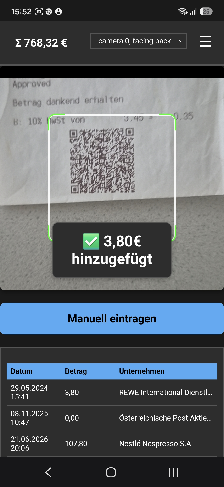

Our application has undergone a relaunch, and we are excited to introduce the new features as a Progressive Web App (PWA). This approach ensures a smoother user experience and greater accessibility. 

Give it a try at [BelegScan.at](https://belegscan.at).

<!-- truncate -->

## What is BelegScan?

BelegScan reads Austrian cash register QR codes (RKSV - Registrierkassensicherheitsverordnung) and displays receipt data clearly. The web app works for free and runs directly in your browser – no app installation required.

## Key Features

- **Signature Validation**: Automatically verifies the cryptographic signature of RKSV QR codes to ensure receipt authenticity and integrity
- **No Installation Required**: Works as a Progressive Web App directly in your browser
- **Privacy-Focused**: All receipt data processing happens locally in your browser - no personal data is sent to servers
- **Cross-Platform**: Works on iPhone, Android, and desktop browsers
- **Free to Use**: Completely free with no hidden costs
- **Offline Capable**: Once loaded, the PWA works even without an internet connection
- **Scan Receipts**: Easily scan Kassabons, Kassenzettel, and Quittungen from Austrian cash registers
- **Clear Display**: View scanned receipt data in an organized, easy-to-read format

## Signature Validation

BelegScan validates the cryptographic signatures embedded in Austrian cash register QR codes according to RKSV (Registrierkassensicherheitsverordnung) requirements. This validation ensures:

- **Authenticity**: Confirms the receipt originates from a registered cash register
- **Integrity**: Verifies the receipt data hasn't been tampered with
- **Compliance**: Helps businesses and consumers verify RKSV compliance
- **Trust**: Provides instant verification that receipts are genuine and unmodified

The signature validation happens entirely in your browser, maintaining complete privacy while ensuring the security and authenticity of your scanned receipts.

## Why PWA?

By relaunching as a Progressive Web App, BelegScan.at offers several advantages:

- **Instant Access**: No need to download from app stores
- **Automatic Updates**: Always get the latest version
- **Less Storage**: Uses minimal device storage compared to native apps
- **Universal Compatibility**: Works across all modern devices and browsers

## Get Started

Visit [BelegScan.at](https://belegscan.at) to start scanning your Austrian cash register receipts today!

For questions or feedback, contact us at [Codeuctivity@gmail.com](mailto:Codeuctivity@gmail.com).