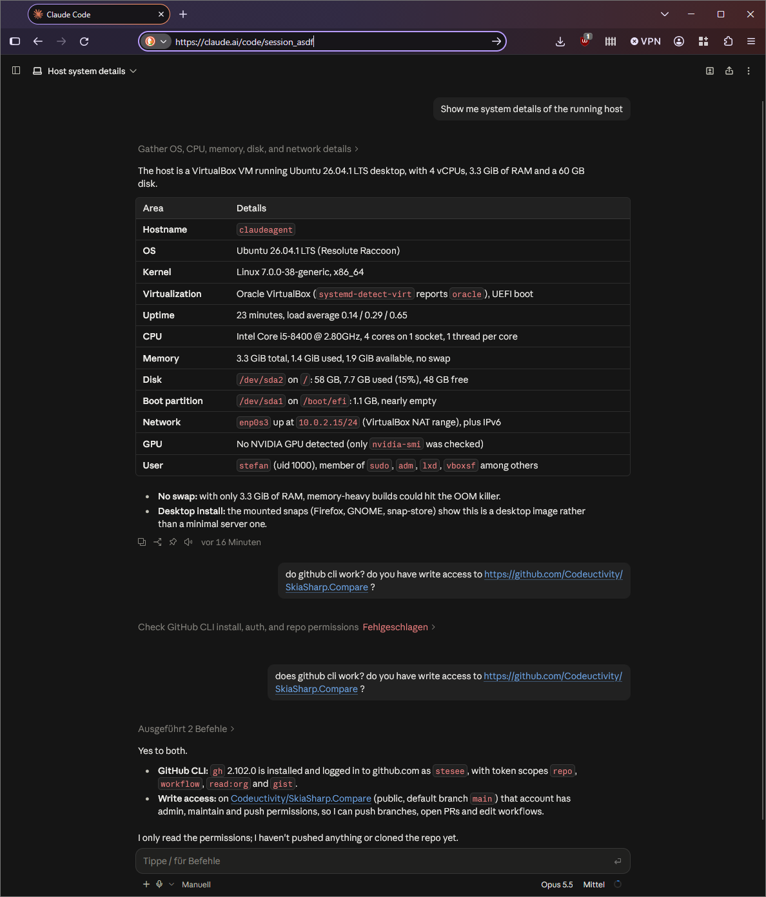

I wanted a disposable Linux machine on my Windows 11 box where Claude Code can run on its own and that I can reach from my phone. Unlike on my main machine, it has no access to my personal data there - a setup a recent [Cloud Security Alliance note on prompt injection in Claude Code](https://labs.cloudsecurityalliance.org/research/csa-research-note-claude-code-automode-prompt-injection-2026/) recommends. This walkthrough covers creating the VM from the command line, the unattended Ubuntu install, a Hyper-V trap that froze the installer, and starting Claude Code Remote Control on every boot.



<!-- truncate -->

## What I used

- Windows 11 Pro host, 6 cores, 16 GB RAM
- VirtualBox 7.2.20
- `ubuntu-26.04.1-desktop-amd64.iso`
- PowerShell 7 on the host

Everything below is done with `VBoxManage`, so it can be repeated without clicking through dialogs.

```powershell
$m   = 'C:\Program Files\Oracle\VirtualBox\VBoxManage.exe'
$n   = 'ClaudeAgent'
$iso = "$env:USERPROFILE\Downloads\ubuntu-26.04.1-desktop-amd64.iso"
```

## Create the VM

4 GB RAM, 4 cores, EFI firmware, NAT networking and a 60 GB dynamically allocated disk.

```powershell
$disk = "$env:USERPROFILE\VirtualBox VMs\$n\$n.vdi"

& $m createvm --name $n --ostype Ubuntu_64 --register
& $m modifyvm $n --memory 4096 --cpus 4 --vram 128 --graphicscontroller vmsvga `
     --firmware efi --ioapic on --nic1 nat --clipboard-mode bidirectional `
     --boot1 dvd --boot2 disk --boot3 none --boot4 none

& $m createmedium disk --filename $disk --size 61440 --format VDI --variant Standard
& $m storagectl $n --name SATA --add sata --controller IntelAhci --portcount 2 --bootable on
& $m storageattach $n --storagectl SATA --port 0 --device 0 --type hdd --medium $disk --nonrotational on
& $m storageattach $n --storagectl SATA --port 1 --device 0 --type dvddrive --medium $iso
```

A dynamically allocated disk only uses what the guest has written (about 9 GB after the install). The 60 GB is a limit, not a reservation - if the host has less free space than that, the host runs full before the VM does. An existing disk can be grown later with `VBoxManage modifymedium disk <file> --resize <MB>`.

## Unattended install

VirtualBox can install Ubuntu without a single click. First check that it recognizes the ISO:

```powershell
& $m unattended detect --iso $iso
```

It reported `Unattended installation supported = yes` and the OS type `Ubuntu25_64` (7.2.20 has no profile for 26.04 yet). Then start the install. The password comes from a file, so it does not end up in the shell history:

```powershell
$pwFile = "$env:USERPROFILE\VirtualBox VMs\$n\initial-password.txt"
Set-Content -Path $pwFile -Value 'choose-a-password' -NoNewline -Encoding ascii

& $m modifyvm $n --ostype Ubuntu25_64
& $m unattended install $n --iso $iso `
     --user stefan --full-user-name 'Stefan' --password-file $pwFile `
     --hostname claudeagent.local --locale en_US --country AT --time-zone Europe/Vienna `
     --install-additions --start-vm=gui
```

`--install-additions` also installs the VirtualBox Guest Additions, which are needed for clipboard sharing, screen resizing and for running commands in the guest from the host (see below).

Delete the password file once the install is done and the password is changed.

## The Hyper-V trap: installer hangs at `raid6: avx2x4 gen()`

The VM booted the installer and then sat there. The last line on screen stayed `raid6: avx2x4 gen()` for minutes, with one CPU core at 100 %.

The reason is in `VBox.log`:

```text
HM: HMR3Init: Attempting fall back to NEM: VT-x is not available
```

Hyper-V was active on the host (Hyper-V services, WSL 2 and virtualization-based security all need it). VirtualBox then cannot use VT-x directly and runs the VM through the Windows Hypervisor Platform instead. With the default paravirtualization interface, the Ubuntu kernel never gets out of an early timing loop.

The fix is one setting on the VM - the host stays untouched:

```powershell
& $m controlvm $n poweroff
& $m modifyvm $n --paravirt-provider hyperv
& $m startvm $n --type gui
```

After that the installer ran through, rebooted into the installed system and ended at the login screen.

Two more things I learned on the way:

- Disabling x2APIC (`--x2apic off`) does not help. The VM refuses to start with `Cannot disable the APIC for a 64-bit guest`.
- VMs in this mode are noticeably slower than with native VT-x. Full speed needs Hyper-V turned off on the host, which also takes WSL 2 away.

## Running commands in the guest from the host

With Guest Additions running, `VBoxManage guestcontrol` executes commands inside the VM. That is enough to do the whole post-install setup without touching the VM window.

```powershell
& $m guestcontrol $n --username stefan --password 'your-password' `
     run --exe /bin/bash -- -c "id; uname -r"
```

In VirtualBox 7.2 the arguments after `--` are the real arguments, without a leading program name. Writing `-- bash -c "..."` ends in `cannot execute binary file`.

For anything longer than one line, copy a script into the guest and run it:

```powershell
& $m guestcontrol $n --username stefan --password 'your-password' `
     copyto .\setup.sh --target-directory /tmp/
& $m guestcontrol $n --username stefan --password 'your-password' `
     run --exe /bin/bash -- /tmp/setup.sh
```

Save such scripts with LF line endings, otherwise bash trips over the `\r`.

## Post-install setup

Run as root inside the VM (`sudo bash root.sh`):

```bash
export DEBIAN_FRONTEND=noninteractive

# German keyboard, system-wide and on the login screen
localectl set-x11-keymap de pc105

# The unattended install did not apply the time zone
timedatectl set-timezone Europe/Vienna

# Third-party codecs and fonts, with the Microsoft font licence pre-accepted
apt-get -y update
echo "ttf-mscorefonts-installer msttcorefonts/accepted-mscorefonts-eula select true" | debconf-set-selections
apt-get -y install curl ubuntu-restricted-extras

# Additional drivers
ubuntu-drivers install

# Access to VirtualBox shared folders
usermod -aG vboxsf stefan

# New password
echo 'stefan:your-new-password' | chpasswd
```

The GNOME desktop keeps its own keyboard layout per user, and the installer leaves it at `us`. Setting it before the first login does not stick - the first login overwrites it. So log in once, then run this in a terminal as the normal user:

```bash
gsettings set org.gnome.desktop.input-sources sources "[('xkb', 'de')]"
sudo sed -i 's/^xkb=us$/xkb=de/' /var/lib/AccountsService/users/stefan
sudo systemctl restart accounts-daemon
```

The first line switches the running desktop immediately, the other two change the layout stored for the account.

Notes:

- `ubuntu-drivers install` found nothing but `open-vm-tools-desktop` for this virtual hardware. Those are the VMware guest tools - harmless, but of no use under VirtualBox.
- To check the Guest Additions: `systemctl is-active vboxadd vboxadd-service` and `lsmod | grep vbox` should show `vboxguest`, `vboxsf` and `vboxvideo`.
- The keyboard layout on the login screen changes after the next restart.

## Install Claude Code

As the normal user:

```bash
curl -fsSL https://claude.ai/install.sh | bash
~/.local/bin/claude --version
```

The installer puts `claude` into `~/.local/bin`. Ubuntu only adds that folder to the `PATH` at login, so `claude` is not found until you log out and in again (or reboot).

## Use it from the phone or a browser: Remote Control

Remote Control links a Claude Code session running in the VM to the Claude mobile app. The session, its files and its tools stay in the VM; the phone is a window onto it.

```bash
claude auth login        # once, with a claude.ai subscription account
claude remote-control    # shows a link and a QR code
```

It only makes outbound HTTPS connections. The VM's NAT networking is enough - no port forwarding, no bridged adapter.

### Open the session on Android

1. Install the Claude app from the Play Store and sign in with the same claude.ai account that is signed in inside the VM.
2. Open the Code section of the app. The session running in the VM is listed there - tap it.
3. Alternatively scan the QR code: in the terminal where `claude remote-control` runs, press the space bar to show it. With the autostart setup below, `tmux attach -t claude` in the VM gets you to that terminal.

The same works with the Claude app on iOS.

### Open the session in any browser

1. Go to [claude.ai/code](https://claude.ai/code) and sign in with the same account.
2. Pick the session from the list. It is named after the VM, for example `claudeagent-optimized-bird`.
3. Or open the link directly. `claude remote-control` prints it in its terminal:

```text
·✔︎· Connected · workspace · HEAD
    claudeagent-optimized-bird
Continue coding in the Claude mobile app or https://claude.ai/code?environment=env_...
space to show QR code
```

With the autostart setup below, that terminal is the tmux session: run `tmux attach -t claude` in the VM to see the link, and leave again with `Ctrl+B`, then `D`.

No app, extension or VPN is needed - any current browser on any device works, including the phone's browser.

### Good to know

- **Same account everywhere:** the session only shows up for the account that is signed in inside the VM.
- **One session, many windows:** phone, browser and the terminal in the VM show the same conversation. What you type in one appears in the others.
- **Everything runs in the VM:** commands, file edits and permission prompts happen there. The phone only sends your messages and shows the output.
- **The VM has to be up:** if the VM or the Windows host is off or asleep, the session is not listed or shows as disconnected. It comes back when the VM is running again.
- **Not listed?** Check in the VM with `tmux attach -t claude` whether Remote Control is running or waiting at a prompt, and run `claude auth login` if it reports that it is not signed in.

## Start Remote Control at boot

The goal: the VM boots, nobody logs in, and the session is reachable anyway.

Install `tmux` and allow services of the user to run without a login:

```bash
sudo apt-get -y install tmux
sudo loginctl enable-linger stefan
mkdir -p ~/workspace ~/.local/bin ~/.config/systemd/user
```

A small loop that restarts Remote Control if it exits, saved as `~/.local/bin/claude-remote-loop` and made executable with `chmod +x`:

```bash
#!/bin/bash
# Keeps Claude Code Remote Control running; restarts it if it exits (e.g. not signed in yet).
# Ctrl+C stops claude but not this loop.
trap : INT
cd "$HOME/workspace" || exit 1
while true; do
  "$HOME/.local/bin/claude" remote-control
  echo "claude remote-control exited ($?), retrying in 30s - run 'claude auth login' if not signed in"
  sleep 30
done
```

The user service, saved as `~/.config/systemd/user/claude-remote.service`:

```ini
[Unit]
Description=Claude Code Remote Control (in tmux session "claude")
After=network-online.target

[Service]
Type=forking
ExecStart=/usr/bin/tmux new-session -d -s claude %h/.local/bin/claude-remote-loop
ExecStop=/usr/bin/tmux kill-session -t claude
Restart=always
RestartSec=10

[Install]
WantedBy=default.target
```

Enable it and stop the VM from going to sleep:

```bash
systemctl --user daemon-reload
systemctl --user enable --now claude-remote.service
gsettings set org.gnome.settings-daemon.plugins.power sleep-inactive-ac-type 'nothing'
```

Running it inside `tmux` has a second benefit: `tmux attach -t claude` shows the live session in a terminal, for example to confirm the first-run prompts. Detach again with `Ctrl+B`, then `D`.

## Start the VM with Windows

To start the VM in the background at every Windows logon:

```powershell
schtasks /Create /TN "ClaudeAgent VM" /SC ONLOGON /TR "'C:\Program Files\Oracle\VirtualBox\VBoxManage.exe' startvm ClaudeAgent --type headless"
```

A headless VM has no window, but one can be attached at any time: select the VM in the VirtualBox Manager and click **Show**, or run `VBoxManage startvm ClaudeAgent --type separate`. When closing that window, pick **Continue running in the background** - the other options stop the VM and with it the Remote Control session.

Remove the task again with `schtasks /Delete /TN "ClaudeAgent VM"`.

## What to keep in mind

- **Memory:** the VM reserves its 4 GB while it runs. On a 16 GB host that is noticeable; during the install my host ran critically low on free memory.
- **Disk:** the dynamic disk grows up to 60 GB. Keep an eye on free space on the host.
- **Speed:** with Hyper-V active on the host, the VM runs in the slower fallback mode. It works, but it is not fast.
- **Host must stay awake:** if Windows sleeps, the VM and the session are gone until it wakes up.

For questions or feedback, contact us at [Codeuctivity@gmail.com](mailto:Codeuctivity@gmail.com).
